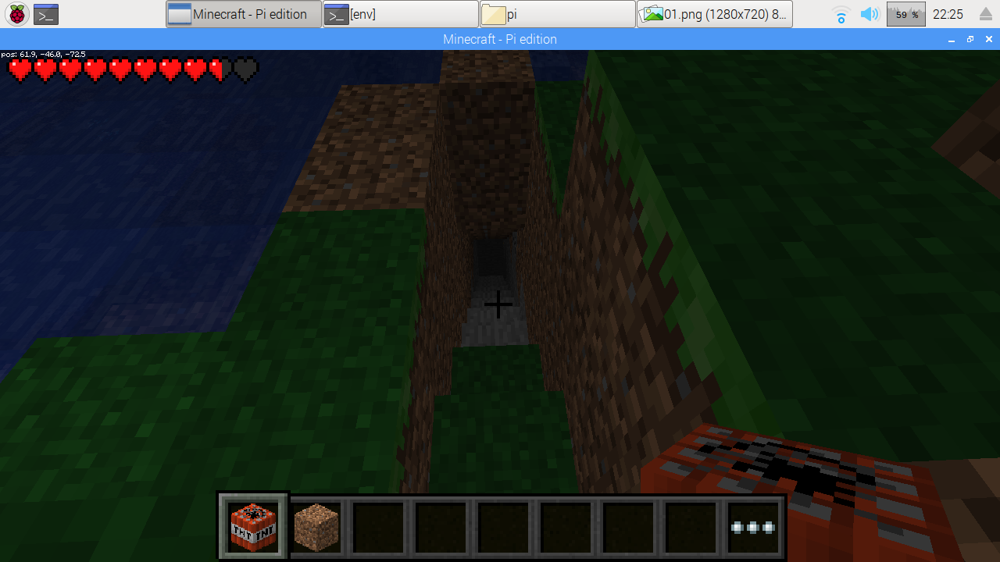

目的
----
* 子供と遊ぶ
  - 子供がRaspberry PIでMinecraftPIで遊んでいるところに
    PCからLAN経由でちょっかいを出す。

スクリーンショット
------------------

用意するもの
-------------
* MinecraftPIが動作するように設定済みのRaspberry PI
  - LANに接続されIPアドレスがあること
  - サバイバルのパッチ済み
  - 壊してもよいSAVE DATA(大事なワールドでは試さないでください。)
+ PC
  - win10 later

使い方
-------
１．RPIのIPアドレスを調べておく
   - 画面右上のWIFIから取得してもよいです。
   - RPIのターミナルで'ifconfig'と入力する
２．Windowsでアプリを起動する
    - リリースを展開し、「MCPIDEMO.exe」をダブルクリック
３．IPアドレスを入力して「接続」ボタンを押す
    - MinecraftPIに接続されたメッセージが表示される
４．適当なボタンを押して、Worldをハチャメチャにする

機能
-----
以下がWindowsPCからRPIのMinecraftPIに対してボタン一つでできます。
* SteavePIを任意地点にテレポートさせる
* SteavePIを上空に振り飛ばす
* 地底の入り口を作る
* 螺旋階段を作る

* 塔を作る（未リリース）
* 大きな壁を作る（未リリース）
* 砂の塔を作る（未リリース）
* 溶岩の成る木（未リリース）

その他
-------
* MinecraftPIのサバイバルパッチで敵を倒す方法
  - 水に沈める
  - 溶岩に落とす
  - 上から突き落とす
  - 上から砂ブロックを落として挟む

動機
----
RPIの画面でプログラミングっていうのはどうなのかと思って
WindowsからAPIでコントロールするところをやってみました。
意外と簡単にできることが分かったので、Scratchじゃなく実装してみました。
RPIのMinecraftPIは機能が限定されていて、本家のないものねだりだと面白くないので
この制限で楽しむためにはという発想で試してみました。
また、Java版のRaspberry Jam Modでは動作確認してません

注意
----
家やオブジェが壊れても責任取れませんので
大事なワールドでは実施しないでください。

参考
----
https://github.com/martinohanlon/mcpi

